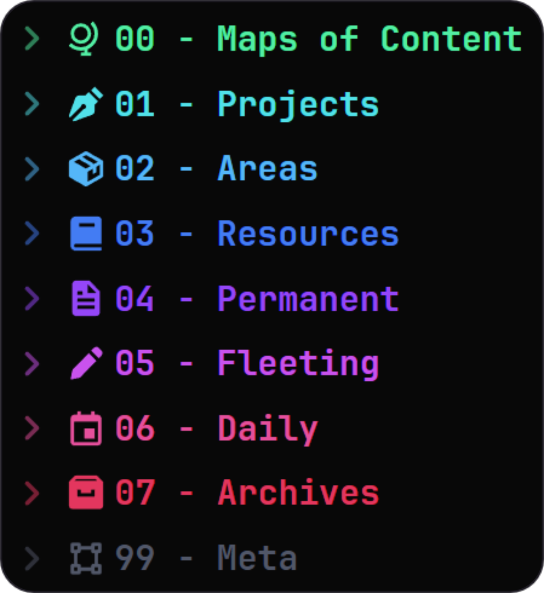

# Obsidian-Colored-Sidebar v2.0.0
## A Colored Sidebar CSS Snippet for Obsidian.

### *Create a [colorfully cascading](https://youtu.be/rAkerV8rlow) Obsidian sidebar!*

This snippet targets folders beginning with numbered prefixes, and applies full
color formatting based on the root colors listed inside the snippet. The prefixes are both
customizable and extensible; feel free to change, add, and remove them based on
your own titles and vault structure! By default I have a range of 8+1 colors,
however I've provided some other common colors as a starting point for your own
customization. Just swap out the color variable names in the prefix groups.

## Installation
To install the snippet, navigate to Settings -> Appearance inside of Obsidian and scroll down to the "CSS Snippets" section. From there, click the "Open Snippets Folder". Place the "Colored Sidebar Items.css" file from this repository inside this opened folder. Back in Obsidian, hit the "Reload Snippets" button and toggled on the "Colored Sidebar Items" snippet. Now that the snippet is loaded, refer to the [How It Works](#How-It-Works) section to get it fully working in your vault!

## How It Works
By default, the snippet targets folders beginning with numbered prefixes (00 though 07, + 99). These prefixes have assigned color values inside the CSS file, and when lined up together form a continuous gradient (with the exception of 99). *Make sure to prepend your folder names with these prefixes for the colors to work!*

### Customizing Colors
To customize the colors, prefixes, and number of colors, you’ll need to open up the CSS snippet in the text editor of your choice. Under the `root`, you’ll see several color variables with their corresponding hexadecimal code values. To modify a color, just change out the hex value with your new color value. If you wish to add a new color to the list, just follow the pattern and add a new variable in this section.

### Customizing Prefixes
Further down in the CSS file, you’ll see the CSS class names targeting folders, named something like `.nav-folder-title[data-path^="00"]`. There are currently four of these classes that target **each** colored group, which you can quickly tell apart by the prefix they target (in this example, `"00"`). If you wish to change the prefixes to any other number, letter, or word, just replace the old numbers in quotations with your new values. If you'd like to select a folder in some way other than by a prefix, [this article](https://css-tricks.com/almanac/selectors/a/attribute/) shows how to modify the selector in additional ways.

### Adding Additional Folders
If you wish to expand the list of colored folders, then just create a copy of one of the four groups of CSS classes that target the same prefix. Change this duplicated prefix and swap out any instance of a color variable (ex. `--cool-gray`) with your desired color variable. These variables are peppered into these classes all around, and if you accidentally miss one then you'll see the old color show up in parts of this new folder theme, so make sure to double check!

You may have noticed that I’ve included several built-in color variables that are not used by default - these are from my own personal matching palette that you’re free to try out to expand your colored sidebar with!

---

Goes great with the [Iconize](https://github.com/FlorianWoelki/obsidian-iconize) plugin!

*Inspired by the "Coloured Folders" snippet by Lithou.*
